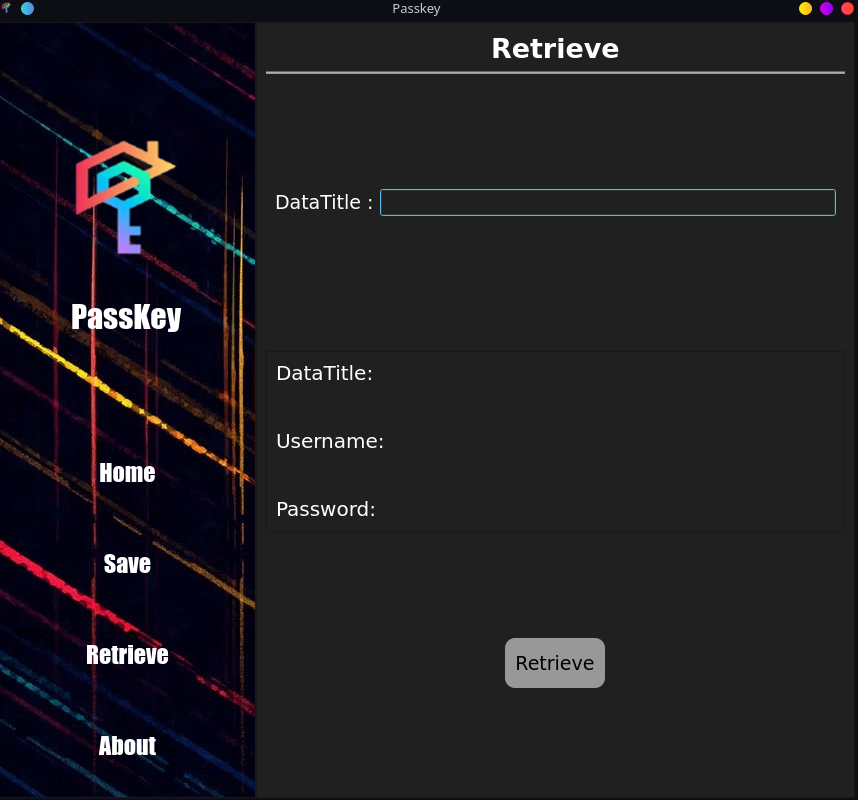

# PassKey
**A open source program to safely save your passwords**
<!---->

# installation
## installation for windows
1. download the Windows installer for PassKey: [url](https://github.com/LalitCreations/PassKey/raw/master/PassKey_Windows.msi) 

2. Run PassKey_Windows.msi to complete the installation

## installation for linux
1. Download to PassKey.tar.xz file: [url](link)
2. extract PassKey.tar.xz file
3. change directory to the extracted folder
4. replace "ADD PATH HERE" in PassKey.desktop to the path of the extracted folder
5. run the following commands in the terminal
`sudo chmod +x install.sh`
`./install.sh`

## run from source
1. clone git repo
2. download python3
3. run passkey.py using
`python3 src/passkey.py`

# preview

